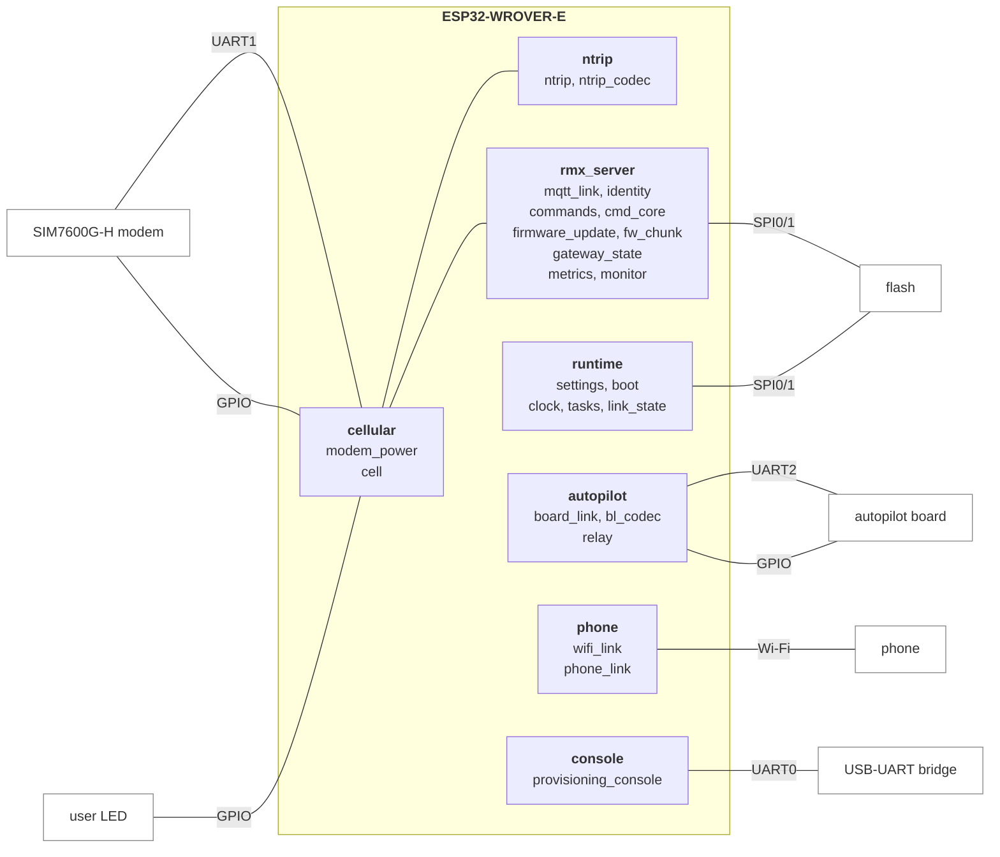

# Block diagram draft

Hand-drawn, not generated. Level 2: subsystems.

```mermaid
flowchart LR
  modem["SIM7600G-H modem"]
  led["user LED"]
  subgraph cpu["<b>ESP32-WROVER-E</b>"]
    cellular["<b>cellular</b><br/>modem_power<br/>cell"]
    ntrip["<b>ntrip</b><br/>ntrip, ntrip_codec"]
    server["<b>rmx_server</b><br/>mqtt_link, identity<br/>commands, cmd_core<br/>firmware_update, fw_chunk<br/>gateway_state<br/>metrics, monitor"]
    runtime["<b>runtime</b><br/>settings, boot<br/>clock, tasks, link_state"]
    autopilot["<b>autopilot</b><br/>board_link, bl_codec<br/>relay"]
    phone["<b>phone</b><br/>wifi_link<br/>phone_link"]
    console["<b>console</b><br/>provisioning_console"]
  end
  fl["flash"]
  ap["autopilot board"]
  ph["phone"]
  usb["USB-UART bridge"]
  modem ---|"UART1"| cellular
  modem ---|"GPIO"| cellular
  led ---|"GPIO"| cellular
  cellular --- server
  cellular --- ntrip
  cellular ~~~ runtime
  cellular ~~~ autopilot
  cellular ~~~ phone
  cellular ~~~ console
  server ---|"SPI0/1"| fl
  runtime ---|"SPI0/1"| fl
  autopilot ---|"UART2"| ap
  autopilot ---|"GPIO"| ap
  phone ---|"Wi-Fi"| ph
  console ---|"UART0"| usb
  classDef device fill:none,stroke:#888
  class modem,led,ap,ph,usb,fl device
```
