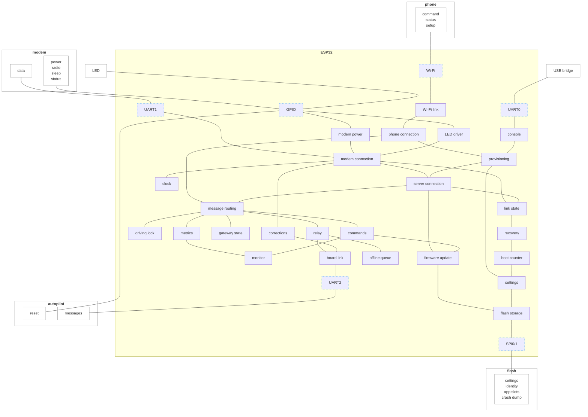

# Block diagram draft

Hand-drawn, not generated. From the hardware to the product function; a line is a connection. Blue: ways of communicating. A device is split by the bus its parts use.

```mermaid
flowchart TD
  subgraph modem["<b>modem</b>"]
    mctl["power<br/>radio<br/>sleep<br/>status"]
    mdata["data"]
  end
  led["LED"]
  subgraph ph["<b>phone</b>"]
    pparts["command<br/>status<br/>setup"]
  end
  usb["USB bridge"]
  subgraph cpu["<b>ESP32</b>"]
    u1["UART1"]
    gp["GPIO"]
    wf["Wi-Fi"]
    u0["UART0"]
    conn["modem connection"]
    pwr["modem power"]
    ledd["LED driver"]
    wl["Wi-Fi link"]
    con["console"]
    ntrip["corrections"]
    mqtt["server connection"]
    phc["phone connection"]
    msg["message routing"]
    lock["driving lock"]
    prov["provisioning"]
    cmd["commands"]
    upd["firmware update"]
    state["gateway state"]
    met["metrics"]
    mon["monitor"]
    ls["link state"]
    clk["clock"]
    rec["recovery"]
    boot["boot counter"]
    relay["relay"]
    q["offline queue"]
    bl["board link"]
    set["settings"]
    fs["flash storage"]
    u2["UART2"]
    sp["SPI0/1"]
  end
  subgraph ap["<b>autopilot</b>"]
    areset["reset"]
    amsg["messages"]
  end
  subgraph fl["<b>flash</b>"]
    fparts["settings<br/>identity<br/>app slots<br/>crash dump"]
  end
  mdata --- u1 --- conn
  mctl --- gp
  led --- gp
  gp --- pwr --- conn
  gp --- ledd --- conn
  pparts --- wf --- wl
  usb --- u0 --- con
  wl --- phc
  phc --- msg
  phc --- prov
  con --- prov
  conn --- mqtt
  conn --- ntrip
  conn --- clk
  conn --- ls
  mqtt --- ls
  mqtt --- msg
  mqtt --- upd
  msg --- lock
  msg --- cmd
  msg --- state
  msg --- met
  msg --- relay
  met --- mon
  cmd --- mon
  cmd --- upd
  prov --- mqtt
  prov --- set
  ls --- rec
  rec --- boot
  boot --- set
  relay --- q
  relay --- bl
  ntrip --- bl
  upd --- fs
  set --- fs
  fs --- sp --- fparts
  bl --- u2 --- amsg
  gp --- areset
  classDef bus stroke:#58a6ff,stroke-dasharray:3 3
  class u1,gp,u2,wf,u0,sp bus
  classDef device fill:none,stroke:#888
  class modem,mdata,mctl,led,ap,amsg,areset,ph,pparts,usb,fl,fparts device
```
